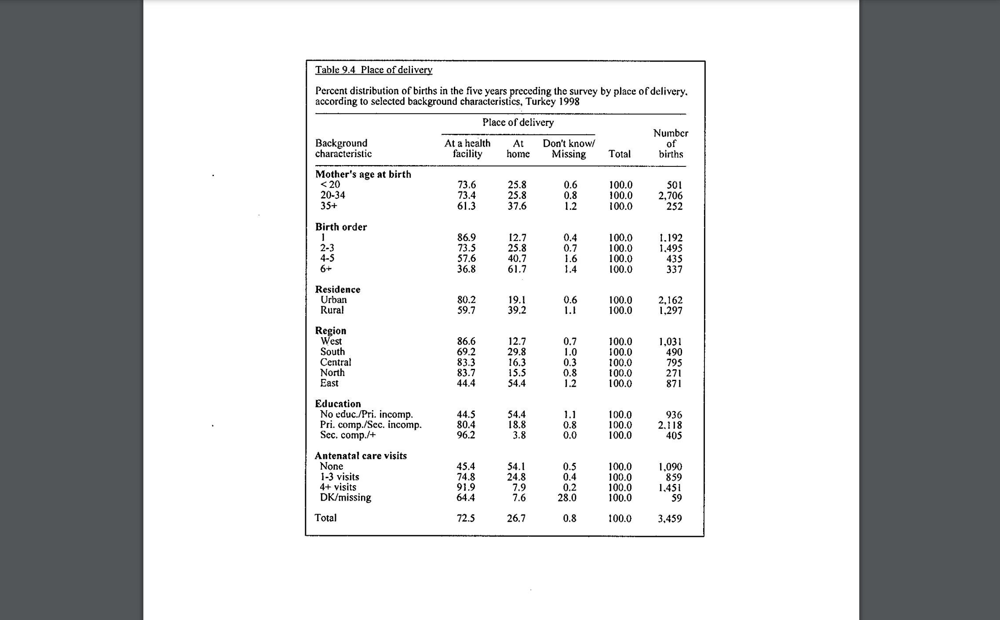

# Data Visualization

```{r, include=FALSE}
library(dplyr)
library(readr)
library(tidyr)
library(tidyverse)
```
First, we download the relevant data sets

```{r, include=FALSE, warning=FALSE, message=FALSE}
# Downloading Age of Mother's birth
age <- readr::read_csv("Mageatbirth.csv")
age

# Downloading Birth order
b_order <- readr::read_csv("BirthOrder.csv")
b_order

# Downloading Residence
residence <- readr::read_csv("Residence.csv")
residence

# Dowloading Education
education <- readr::read_csv("Education.csv")
education
  
# Downloading Region
region <- readr::read_csv("Region.csv")
region

# Downloading Antenatal Care visits
AC <- readr::read_csv("AC_Visits.csv")
AC
```

```{r, include=FALSE, message=FALSE}
df1 <- age %>% 
  tidyr::pivot_longer(HF: DK , names_to = "measure",
               values_to = "score")
df1

df2 <- b_order %>% 
  tidyr::pivot_longer(HF: DK , names_to = "measure",
               values_to = "score")
df3 <- residence %>% 
  tidyr::pivot_longer(HF: DK , names_to = "measure",
               values_to = "score")
df4 <- education %>% 
  tidyr::pivot_longer(HF: DK , names_to = "measure",
               values_to = "score")
df5 <- region %>% 
  tidyr::pivot_longer(HF: DK , names_to = "measure",
               values_to = "score")
df6 <- AC %>% 
  tidyr::pivot_longer(HF: DK , names_to = "measure",
               values_to = "score")
```

Plots

```{r, echo=FALSE, warning=FALSE, message=FALSE}
plot1 <- ggplot2::ggplot(df1, aes(x = age, y=score, fill = measure)) + 
  geom_col(position = "dodge") + 
  labs(title="Figure 1: Place of Delivery by Mother's age at birth",
        x ="Age groups", y = "Count in %")
plot1

plot2 <- ggplot2::ggplot(df2, aes(x = BirthOrder, y= score, fill = measure)) + geom_col(position = "dodge") + 
  labs(title="Figure 2: Place of delivery by Child Birth Order",
        x ="Birth order position", y = "Count in %")
plot2

plot3 <- ggplot2::ggplot(df3, aes(x = Residence, y = score, fill = measure)) + geom_col(position = "dodge") + 
  labs(title="Figure 3: Place of Delivery by Residence",
        x ="Residence", y = "Count in %")
plot3

plot4 <- ggplot2::ggplot(df4, aes(x = Education, y = score, fill = measure)) + geom_col(position = "dodge") + 
  labs(title="Figure 4: Place of Delivery by Mother's Educational level",
        x ="Educational level", y = "Count in %")
plot4

plot5 <- ggplot2::ggplot(df5, aes(x = Region, y = score, fill = measure)) + geom_col(position = "dodge") + 
  labs(title="Figure 5: Place of Delivery by Region of Birth",
        x ="Region", y = "Count in %")
plot5

plot6 <- ggplot2::ggplot(df6, aes(x = AC_Visits, y = score, fill = measure)) + geom_col(position = "dodge") + 
  labs(title="Figure 6: Place of Delivery by Antenatal Care Visits",
        x ="Number of Visits", y = "Count in %")
plot6
```
# Data

The data is obtained from the Demographic and Health Surveys (DHS) hosted on the DHS website in PDF formats. We obtained data from the Turkey DHS Final Report from 1998. The report consists of a wide range of data regarding Children health and its indicators such as mortality, nutrition, water supply and education. Further, other supporting indicators data is provided such as mother's health and nutrition and infant vaccination rates.
We obtained table 9.4 from the Turkey 1998 DHS Report for our analysis.This table consists of important statistics regarding birth statistics such as mother's age at birth, child birth order, residence of birth, region of birth, mother's educational attainment levels and total number of antenatal care visits during birth. These variables are further classified by the place of delivery of the child - at health facility or at home. 
In terms of confidentiality, only aggregate levels were used to construct the table and no micro data containing individual patient information has been obtained or utilized. The method of categorization of this data set (ordering by place of delivery) limits us to compare data to other similar reports.

As stated previously, we look at Table 9.4 from the Turkey 1998 DHS Final Report on pages 109-110. We consider all sections of this table - Mother's age at birth, birth order, residence, region, education and Antenatal Care (AC) visits. We look at all the variables and match them with their respective columns regarding the place of delivery. We do so to gain a clear understanding on how hygiene patterns during delivery and proper medical attention affect birth outcomes in children. Table 1 is shown below - \@ref(tab:table1).

```{r table1, echo=FALSE}

```


# Discussion Point 1

```{r}

```

